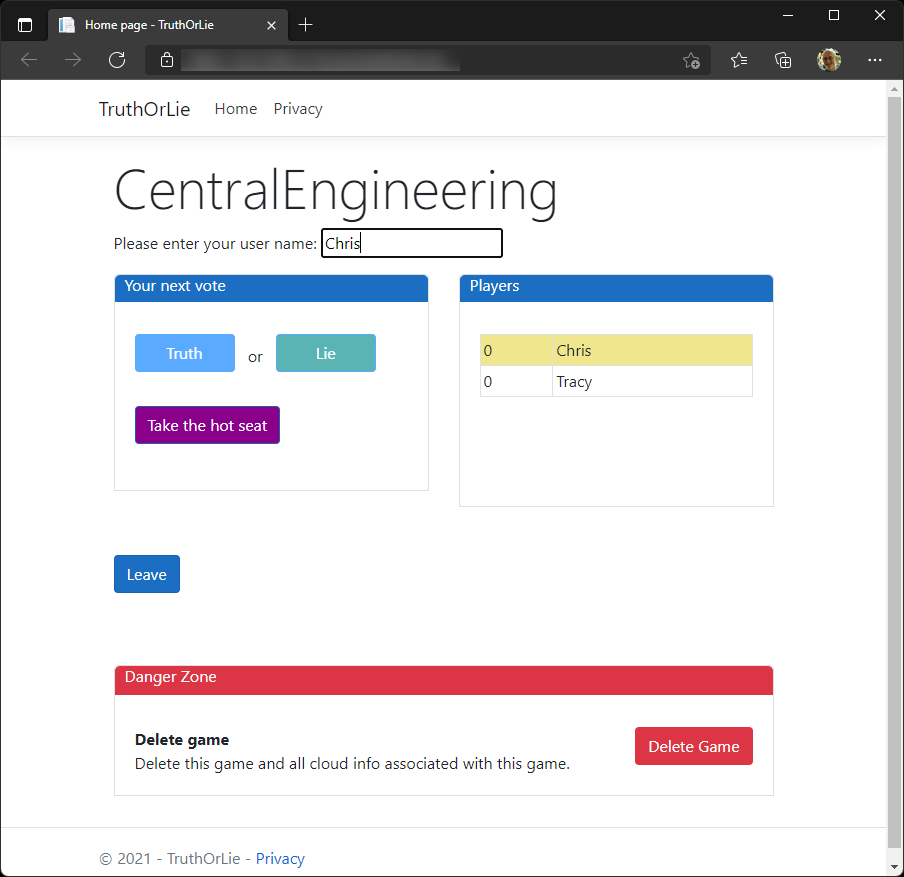

# TruthOrLie

Simple implementation of the Truth or Lie game with online voting and realtime score tabulation so you can focus on having fun with your team.

See [Demo Video](https://lovettsoftwarestorage.blob.core.windows.net/videos/TruthOrLie.mp4)



### Installation

This program requires the following:

1. Google Firebase Account
2. Azure Account for ASP.NET Core Web hosting

After cloning the repo and setup your local user-secrets by copying
the following Firebase account information:
```
cd TruthOrLie\src
dotnet user-secrets init"
dotnet user-secrets set FirebaseApiKey "..."
dotnet user-secrets set AuthDomain "..."
dotnet user-secrets set DatabaseURL "..."
dotnet user-secrets set ProjectId "..."
dotnet user-secrets set StorageBucket "..."
dotnet user-secrets set MessagingSenderId "..."
dotnet user-secrets set AppId "..."
```

Then run the following script to setup your Azure account:

```
az login
az account set --subscription ...
pwsh -f azure_setup.ps1
```

This will create the necessary Azure resources to host your app.
Then load the Visual Studio 2019 Solution: `TruthOrLie.sln`

3. Rebuild the solution,
4. Right click the project and select `Publish`
5. Create publish profile and publish your app to the resource group created by  `azure_setup.ps1`

If all goes well you will soon see the welcome page where you can
create a new game or join an existing game, and when you create a new
game the data should show up in your [Google Firebase project](https://console.firebase.google.com/u/0/project/) under [Realtime Database](https://firebase.google.com/docs/database/web/structure-data).
